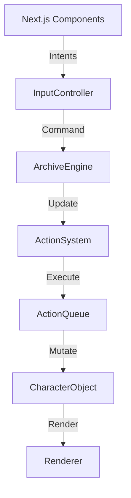

# ARCHITECT AUDIT: The Archive Room (Spatial Reasoning Engine)

**Audit Date**: 2026-04-27
**Status**: 🚨 RED (Structural Fragility detected in core loop)

## 1. Executive Summary
The Archive Room is a high-performance spatial simulation. While the performance is excellent (60FPS), the underlying logic has drifted into a "Big Ball of Mud" pattern. Business logic is scattered between the React UI layer and the Imperative Engine. Character state management is procedural and mutation-heavy, posing a high risk for regression as AI complexity increases.

## 2. Identified Risks & Logic Holes

### 🔴 Risk A: Input Logic Leakage (NexusCanvas.tsx)
**Issue**: `NexusCanvas.tsx` (850+ lines) contains critical game logic in `handleClick`. It decides if a seat can be reassigned or if a furniture click should trigger a command.
**Failure**: If we add a new input method (e.g., keyboard shortcuts or mobile touch), we have to duplicate this complex logic or risk inconsistent behavior.
**Solution**: Extract `InputManager` to handle "World Picking" and translate it into `Intent` objects for the Engine.

### 🔴 Risk B: Procedural Update Bloat (characters.ts)
**Issue**: `updateCharacter` is a monolithic switch. It requires 7+ context arguments to function.
**Failure**: Adding a new character state (e.g., "Collaboration" or "ErrorState") requires touching 4-5 different locations in a single file, increasing the chance of side effects.
**Solution**: Implement a `State` or `Action` pattern where each behavior is a self-contained class/object.

### 🟡 Risk C: Kernel Coordination Overload (ArchiveEngine.ts)
**Issue**: `rebuildFromLayout` manually iterates characters to fix seats. This is a coordination concern that should be handled by an event system or a dedicated `ReconciliationService`.
**Solution**: Implement a simple internal Event Bus (`engine.on('layout:rebuild', ...)`).

## 3. Performance Bottlenecks
*   **Pathfinding Frequency**: Pathfinding is currently called inside the update loop for roaming and returning to seats. 
*   **Weak Cache Utilization**: `spriteCache.ts` is effective, but `renderer.ts` still does a lot of z-sorting on every frame even if nothing moved.

## 4. Architectural Target (To-Be)

## 5. Verification Plan
*   **Diagnostic Color Change**: Implement a "Debug Mode" toggle that highlights the current `Action` of every agent in a specific color.
*   **Baseline Comparison**: Run the backend command sequence `THINK -> RAG_SEARCH -> TYPE` and verify identical arrival timings and notification callbacks.
