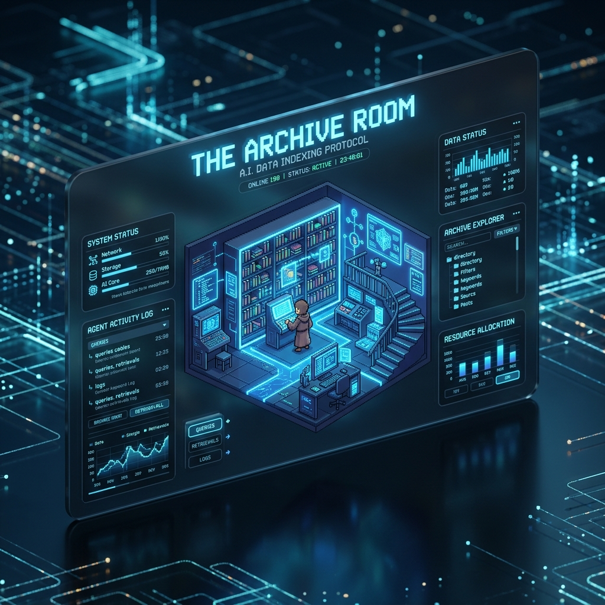
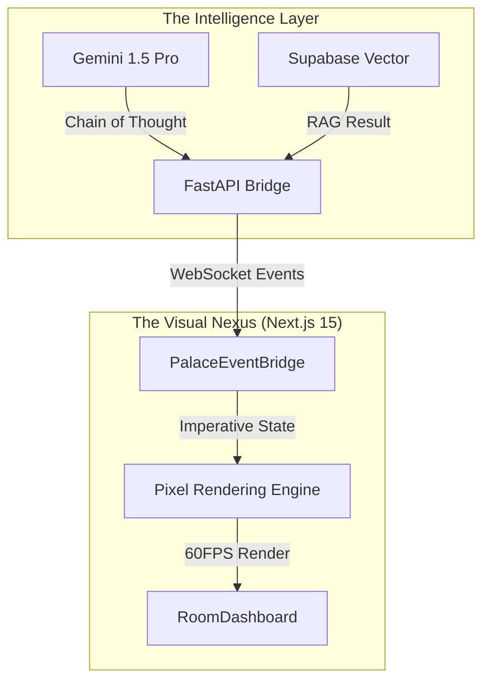

<div align="center">

# 🏛️ THE ARCHIVE ROOM
### **The Autonomous Data Nexus & AI Memory Palace**



**Transforming raw AI logic into a high-fidelity, interactive spatial simulation.**

[](https://github.com/kwakhare5/The-Archive-Room)
[](https://nextjs.org/)
[](https://github.com/kwakhare5/The-Archive-Room)

[**Explore the Nexus →**](https://the-archive-room.vercel.app) | [**View Architecture →**](#-architecture-the-data-nexus) | [**Request Access →**](https://github.com/kwakhare5/The-Archive-Room/issues)

</div>

---

## 💎 The Vision: Observability Through Spatial Memory

Modern AI agents operate in "Black Boxes." **The Archive Room** breaks the box. By leveraging the **Method of Loci (Memory Palace)**, we map ephemeral agent reasoning, RAG retrievals, and tool executions onto a physical, pixel-art environment.

When an agent "thinks," you don't just see a log—you see them walk to the **Whiteboard**. When they retrieve data, they visit the **Archives**. This is the future of **Human-AI Interpretability**.

---

## ✨ Core Capabilities

### 🛰️ Real-Time Event Bridge
Zero-latency WebSocket synchronization between your FastAPI backend and the Next.js 15 frontend. Watch agents react to code hooks, file changes, and live sessions in sub-10ms intervals.

### 🧠 Spatial Intelligence Mapping
- **The Archives (RAG)**: Visual representation of Vector Database queries.
- **The Thinking Hub**: Real-time visualization of LLM chain-of-thought phases.
- **Agent Swarm Management**: Seamlessly monitor multiple sub-agents in a shared isometric space.

### 🎨 Elite Design System (LOCKED)
A bespoke, high-contrast **"Data Nexus"** aesthetic built on **Tailwind CSS v4**. Featuring glassmorphism HUDs, professional pixel-art assets, and a 60FPS rendering engine optimized for smooth panning and zooming.

---

## 🏗️ Architecture: The Data Nexus



---

## 🚀 The Elite Stack

| Tier | Technology | Business Value |
| :--- | :--- | :--- |
| **Frontend** | **Next.js 15 (Turbopack)** | Enterprise-grade speed and SEO-ready architecture. |
| **Styling** | **Tailwind CSS v4** | Token-driven design consistency with sub-pixel precision. |
| **Backend** | **FastAPI + Uvicorn** | High-concurrency event handling for real-time swarms. |
| **Real-time** | **WebSockets (PalaceBridge)** | Persistent, stateful communication with sub-10ms latency. |
| **Database** | **Supabase Vector (pgvector)** | Production-ready spatial data retrieval. |

---

## 🛠️ Setup & Deployment

### Engineering Environment
```bash
# Clone the Enterprise Repository
git clone https://github.com/kwakhare5/The-Archive-Room.git
cd The-Archive-Room

# Ignite the Visual Nexus
npm install
npm run dev
```

### Backend Bridge Initialization
```bash
# Navigate to Intelligence Layer
cd backend
pip install -r requirements.txt

# Launch High-Concurrency Server
python main.py
```

---

## 📅 Roadmap to V1.0 (Enterprise Ready)

- [x] **Infrastucture**: Next.js 15 App Router & Turbopack Integration.
- [x] **Visual Identity**: Full UI Redesign & Strict Immutability Lock.
- [/] **Connectivity**: FastAPI WebSocket Bridge (Sub-agent Sync).
- [ ] **Data Layer**: Supabase Vector Integration (Always Live).
- [ ] **Deployment**: Vercel Edge Distribution.

---

## 🤝 Contribution & Support

The Archive Room is an **Elite-Tier** open-source project. We welcome contributions that align with our **Architecture Audit** guidelines.

- **Founder**: [Karan Wakhare](https://github.com/kwakhare5)
- **Twitter**: [@kwakhare5](https://twitter.com/kwakhare5)

---

<div align="center">
Built with 💜 for the future of Autonomous Intelligence.
</div>
